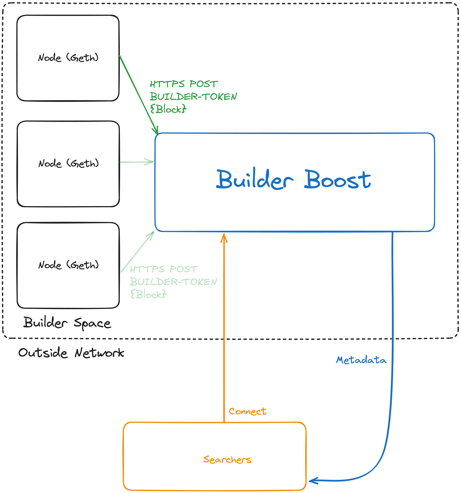

# Builder Boost


Builder Boost is an sidecar software developed to facilitate a builder's participation in the Primev network. The provided diagram outlines the software's position within a builder's local build environment.

Builder Boost Diagram



You can run builder-boost as both a docker container or as a binary. We recommend you run it as an independent EC2 instance.
Considering the variability of IP addresses of arbitrary searchers, the network configurations should be permissive.


## Setting Up Builder Boost
Begin by reviewing the Builder Reference Implementation instructions provided [here](https://hackmd.io/wmmCgKJdTom9WXht2PcdLA). Following the necessary modifications, you can proceed to set up Builder Boost.


## Searcher Testing
In order to emulate multiple searchers locally and testing your setup, systemctl files have been included. The Boost repository also contains a dummy searcher implementation, a useful tool for validating your local configuration and monitoring for uptime. The searcher implementation can be found in the searcher directory, with the binary accessible in the root directory upon successful project build.

### Pre-Requistes
- A browser wallet with two accounts
  - One account will be used to emulate the searcher (this account will need to hold significant funds)
  - The other account will be used to for the builder (this account will needs sufficient funds to send a transaction to the contract)

## Wallet Setup
1. First let's start by funding a few accounts with sepolia ETH
2. Download a wallet provider, you can find the one we will use for this demo [here](https://metamask.io/download/), proceed to hit install. Follow any steps requested.
3. Once your metmask extention has been added to the browswer, click on the icon and proceed to create a new wallet. It will ask you for a password and provide you with a seed phrase that you will want to keep safe.
4. Once you have created your wallet, you will need to add the sepolia network to your wallet. To do this, click on the network dropdown and you should see show/hide Testnets. Hit the link, and toggle testnets. You should now see sepolia and other testnets in the network dropdown.
5. Now go ahead and click the profile picture circle on the top right of your wallet interface and hit create account and name it "searcher emulator".
6. Now switch back to account 1 and hit account details and rename it "builder". Now click export private key from the account details page and copy the private key. You will need this later.
7. Connect to the searcher account in your wallet and get some sepolia ETH from the faucet [here](https://sepolia-faucet.pk910.de/). Once you've acquired enough seploia eth, send a transaction with 5-10% of the sepolia eth to the Builder Account. You can get the builder account address that you will need from the wallet, it will appear representation, similar to the following: 0x9f2...5E40

A contract is currently deployed here:
- https://sepolia.etherscan.io/address/0xc38e581D0403b4065F4d61A838431B143ceE4c81

**Step 1.** Build `boost` command:
```
$ make all
```

**Step 2.** Run `boost` command:
```
$ ./boost --addr :8080 --rollupkey `<builder-private-key>` --buildertoken `<builder-auth-token>`
```
You can get the builder private key from step 6 in the wallet setup section.
You come up with you're own builder auth token, you will want to set this value as a header `X-BUILDER-TOKEN` in your Builder instance while posting data to Boost.

**Step 3.** Go [here](https://sepolia.etherscan.io/address/0xc38e581D0403b4065F4d61A838431B143ceE4c81#writeContract) and click on the `setMinimalStake`. Here you can connect the wallet associated with the builder and set the minimal stake needed to connect to you to get execution hints.

**Step 4.** Disconnect your builder wallet, this can be done by going to the wallet and clicking on the "Connected" indicator next to your account name in the wallet modal. Now click the 3 dots to the right of the account and press disconnect.

**Step 5.** Receive commitment hash from builder:
```
$ curl "http://localhost:8080/commitment?searcherAddress=<searcher-address>"
```

**Step 6.** Connect any wallet (to preserve privacy, do not use searcher address) and add the required funds to the `deposit` function. In commitment field input hash returned from **Step 5**. The amount should be equal to or greater than the minimum amount you set in **Step 3**.

**Step 7.** Connect as a searcher:
```
$ ./searcher --boostaddr localhost:8080 --searcherkey <searcher-private-key>
```

**Step 8.** Connect to the local env in [this](https://primev.postman.co/workspace/Team-Workspace~18870d84-94f0-4d1e-8163-db558f83d7e8/request/27192304-32af6ec4-013b-423f-aff6-44226090fcf6) postman workspace and send the request under `create a block`
