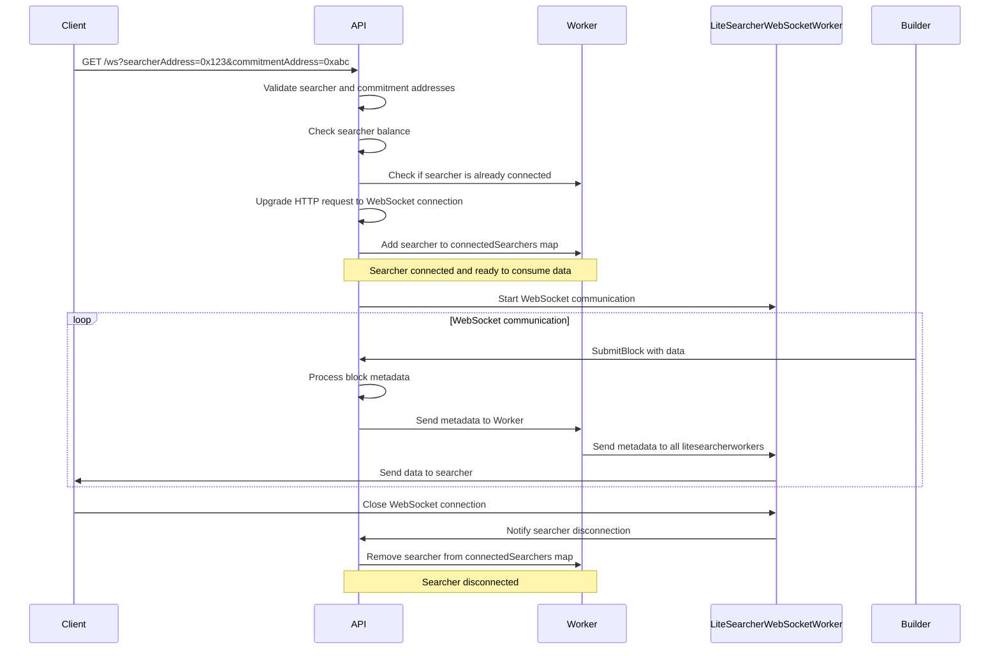

### Overview
In this sequence diagram, the flow and interactions of the API, Builder, Worker, LiteSearcherWebSocketWorker, and Client (searcher) are illustrated. The main actors are:

1. Client (searcher): The client connecting to the API.
2. API: The API that handles incoming requests and WebSocket connections.
3. Worker: The worker responsible for managing connected searchers and their data.
4. A pool of LiteSearcherWebSocketWorker: The WebSocket worker responsible for communicating with the client (searcher) and also represents the websocket connection as a goroutine.
5. Builder: The entity responsible for submitting block data to the API.

The flow of the diagram is as follows:

1. The client sends a GET request with the searcherAddress and commitmentAddress parameters.
2. The API validates the searcher and commitment addresses and checks the searcher's balance.
3. The API verifies if the searcher is already connected to the Worker.
4. If the searcher meets the criteria, the API upgrades the HTTP request to a WebSocket connection and adds the searcher to the connectedSearchers map in the Worker.
5. The API starts the WebSocket communication with the LiteSearcherWebSocketWorker.
6. The Builder submits block data to the API.
7. The API processes the block metadata and sends it to the Worker.
8. The Worker sends metadata to all LiteSearcherWebSocketWorkers.
9. The LiteSearcherWebSocketWorker sends the data to the connected searcher (client).
10. The WebSocket communication loop continues until the client closes the WebSocket connection.
11. When the client closes the WebSocket connection, the LiteSearcherWebSocketWorker notifies the API about the searcher's disconnection.
12. The API removes the searcher from the connectedSearchers map in the Worker.

Throughout this flow, the API, Builder, Worker, LiteSearcherWebSocketWorker, and Client interact and exchange data to ensure the searcher receives the necessary block metadata.